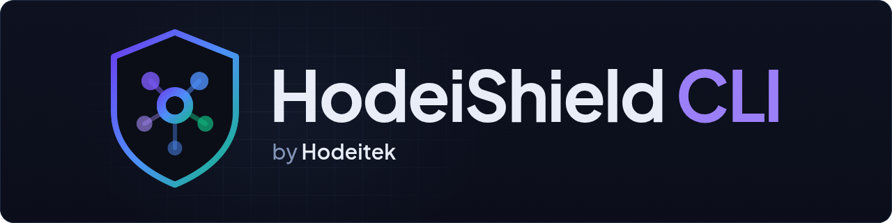

# HodeiShield CLI

[](https://github.com/Hodeitek/hodeishield-cli/releases/latest)
[](https://github.com/Hodeitek/hodeishield-cli/actions/workflows/ci.yml?query=branch%3Amain)
[](LICENSE)
[](docs/verifying-releases.md)

The official command-line client for [HodeiShield](https://hodeishield.com), by
[Hodeitek](https://hodeitek.com). HodeiShield covers third-party risk, supply-chain security and
compliance (NIS2, DORA, ISO 27001, ENS).

## Quick start

```sh
# Download and unpack the archive for your platform from
# https://github.com/Hodeitek/hodeishield-cli/releases/latest, then:
hodeishield login            # sign in through the browser and pick a tenant
hodeishield vendors list     # your third-party inventory
```

Verify the download before you run it: see [Install](#install) and [Verify a download](#verify-a-download).

Read your third-party inventory, supply-chain alerts, risk register, compliance posture, evidence and
endpoint agents from a terminal or a script.

- **Read-only.** Every command is a `GET` against the public `/v1` API. Nothing here can change data in
  your organisation.
- **Safe with credentials.** Sign-in tokens live in the system keychain, never in a file; nothing is
  ever printed or logged; credentials only travel over HTTPS and are never replayed to a redirect.
- **Built for scripts.** `--json` prints the API's own JSON, exit codes say what went wrong, and
  `HODEISHIELD_API_KEY` works without any interactive step.
- **Verifiable.** Every release is signed with Sigstore (keyless, from GitHub Actions) and carries
  SLSA build provenance.

> The CLI is at version 0.x: commands and output may still change before 1.0.

## Install

Download the archive for your platform from the
[latest release](https://github.com/Hodeitek/hodeishield-cli/releases/latest), **verify it** (next
section), and put `hodeishield` (`hodeishield.exe` on Windows) somewhere on your `PATH`.

| Platform | Archive |
|---|---|
| Linux x86_64 | `hodeishield-<version>-x86_64-unknown-linux-musl.tar.gz` |
| Linux arm64 | `hodeishield-<version>-aarch64-unknown-linux-musl.tar.gz` |
| macOS (Apple silicon and Intel) | `hodeishield-<version>-universal-apple-darwin.tar.gz` |
| Windows x86_64 | `hodeishield-<version>-x86_64-pc-windows-msvc.zip` |

`<version>` has no leading `v`: release `v0.3.1` ships `hodeishield-0.3.1-…`. The Linux binaries are
statically linked and run on any distribution. Homebrew and Scoop packages are also available
(next section).

From source, with the Rust toolchain installed (pin the release tag you want):

```sh
cargo install --locked --git https://github.com/Hodeitek/hodeishield-cli --tag v0.3.1 hodeishield-cli
```

### Homebrew and Scoop

```sh
brew tap hodeitek/hodeishield && brew install hodeishield      # macOS and Linux
```

```powershell
scoop bucket add hodeishield https://github.com/Hodeitek/scoop-hodeishield
scoop install hodeishield                                       # Windows, per user
```

The [Homebrew tap](https://github.com/Hodeitek/homebrew-hodeishield) and the
[Scoop bucket](https://github.com/Hodeitek/scoop-hodeishield) are updated from each release's own
files and `SHA256SUMS` when it is published, and both check those hashes when installing. Homebrew
also installs the man pages and shell completions. A winget package has been submitted and is
waiting for review by the winget community repository; it is not available yet.

### Debian, Ubuntu, Fedora, RHEL and other Linux distributions

From 0.3.0, each release also publishes `.deb` and `.rpm` packages for x86_64 and arm64. They install `/usr/bin/hodeishield`, the man pages and the bash, zsh and fish completions.
Verify the package as in the next section (it has its own `.sigstore.json` and is listed in
`SHA256SUMS`), then:

```sh
sudo apt install ./hodeishield_<version>-1_amd64.deb      # Debian, Ubuntu (arm64: _arm64.deb)
sudo dnf install ./hodeishield-<version>-1.x86_64.rpm     # Fedora, RHEL (arm64: .aarch64.rpm)
```

Upgrading is the same command with the newer package; `sudo apt remove hodeishield` or
`sudo dnf remove hodeishield` uninstalls it.

### Windows installer (MSI)

From 0.3.0, each release also publishes
`hodeishield-<version>-x86_64-pc-windows-msvc.msi`, signed with Authenticode like `hodeishield.exe`.
It installs for all users in `%ProgramFiles%\HodeiShield CLI` and adds that folder to the system
`PATH` (open a new terminal afterwards). A newer MSI upgrades an older one in place; uninstall from
**Settings → Apps** or with `msiexec /x`.

Silent installation, for Intune, Group Policy or any other deployment tool:

```powershell
msiexec /i hodeishield-<version>-x86_64-pc-windows-msvc.msi /qn /norestart /l*v hodeishield-install.log
msiexec /x hodeishield-<version>-x86_64-pc-windows-msvc.msi /qn /norestart     # uninstall
```

- **Intune:** add it as a *Line-of-business app* (MSI), or as a *Windows app (Win32)* with the
  commands above. Intune reads the product code from the MSI for detection.
- **Group Policy:** *Computer Configuration → Policies → Software Settings → Software installation*,
  assign the MSI from a network share that the computers can read.
- Every version shares the upgrade code `{32B34E35-7A3F-422A-AC44-59204CD0D59D}`, which detection
  rules and inventory tools can use to find any installed version.

### Install script (Linux and macOS)

From 0.3.0, each release also publishes `install.sh`, signed like the archives. It
downloads the archive for your platform, checks it against `SHA256SUMS` and its Sigstore signature,
and installs `hodeishield` (and its man pages) in `/usr/local/bin` when writable, otherwise
`~/.local/bin`. Do not pipe it into a shell: download it, verify it, read it, then run it.

```sh
v=<version>   # e.g. the latest release, without the leading v
curl -fsSLO https://github.com/Hodeitek/hodeishield-cli/releases/download/v$v/install.sh
curl -fsSLO https://github.com/Hodeitek/hodeishield-cli/releases/download/v$v/install.sh.sigstore.json
cosign verify-blob --bundle install.sh.sigstore.json \
  --certificate-identity https://github.com/Hodeitek/hodeishield-cli/.github/workflows/release.yml@refs/tags/v$v \
  --certificate-oidc-issuer https://token.actions.githubusercontent.com \
  --certificate-github-workflow-trigger push install.sh
less install.sh
sh install.sh --version $v
```

It needs `cosign` to check the archive's signature and stops if it is missing; `--no-verify` skips
that check (the checksum still runs). `sh install.sh --help` lists the options (`--dir`, `--no-man`).

### Man pages

From 0.2.0, the Linux and macOS archives include a man page for every command in `man/`. To read
them with `man`, copy them into a directory on your man path, for example:

```sh
sudo mkdir -p /usr/local/share/man/man1
sudo cp hodeishield-<version>-<target>/man/*.1 /usr/local/share/man/man1/
man hodeishield-vendors-list
```

## Verify a download

Each release has a `SHA256SUMS` file, a Sigstore bundle (`*.sigstore.json`) for every archive and for
`SHA256SUMS`, and SLSA provenance (`hodeishield.intoto.jsonl`). In short:

```sh
sha256sum --ignore-missing -c SHA256SUMS

cosign verify-blob hodeishield-0.3.1-x86_64-unknown-linux-musl.tar.gz \
  --bundle hodeishield-0.3.1-x86_64-unknown-linux-musl.tar.gz.sigstore.json \
  --certificate-identity https://github.com/Hodeitek/hodeishield-cli/.github/workflows/release.yml@refs/tags/v0.3.1 \
  --certificate-oidc-issuer https://token.actions.githubusercontent.com \
  --certificate-github-workflow-trigger push
```

A valid signature proves the file was built by this repository's release workflow from exactly that
tag, with no long-lived key involved; put your version in the identity rather than matching any tag. The full steps, including the provenance check with `slsa-verifier`, are in
[docs/verifying-releases.md](docs/verifying-releases.md).

### If macOS or Windows blocks the binary

From 0.2.0, `hodeishield.exe` is signed with Authenticode, so Windows accepts it;
[docs/verifying-releases.md](docs/verifying-releases.md) shows how to check the signature. The macOS
binary is not yet signed with an Apple Developer ID or notarized; that comes in a later release
([#50](https://github.com/Hodeitek/hodeishield-cli/issues/50)). Until then, and for Windows versions
before 0.2.0, a copy downloaded with a browser can be blocked or flagged. The cosign check above is
the proof that the file is genuine; once it passes, unblock the binary as follows.

**macOS.** Gatekeeper may refuse to open `hodeishield` ("Apple could not verify… is free of
malware"). Remove the quarantine attribute from the unpacked binary:

```sh
xattr -d com.apple.quarantine ./hodeishield   # "No such xattr" means there was nothing to remove
```

Or download with `curl`, which does not set that attribute in the first place:

```sh
curl -LO https://github.com/Hodeitek/hodeishield-cli/releases/download/v0.3.1/hodeishield-0.3.1-universal-apple-darwin.tar.gz
```

**Windows, before 0.2.0.** Unblock the archive before unpacking it, so the executable does not
inherit the download mark:

```powershell
Unblock-File .\hodeishield-0.1.1-x86_64-pc-windows-msvc.zip
Expand-Archive .\hodeishield-0.1.1-x86_64-pc-windows-msvc.zip
```

If you already unpacked it, run `Unblock-File` on `hodeishield.exe` instead. SmartScreen can also
warn about a signed file that is still new to it; in either case, if it shows "Windows protected
your PC", choose **More info → Run anyway** («Más información → Ejecutar de todos modos» on a
Spanish system).

## Authenticate

### With a tenant API key (scripts, CI, servers)

Create a key in [the app](https://app.hodeishield.com) under **Settings → API keys**, with only the
read scopes you need, and export it:

```sh
export HODEISHIELD_API_KEY=hsk_...
hodeishield whoami
```

When `HODEISHIELD_API_KEY` is set it is used for every call, whatever else is configured. Keep it in
your CI's secret store; the CLI never prints it.

### By signing in (people)

```sh
hodeishield login            # opens the browser; the app redirects back to 127.0.0.1
hodeishield login --device   # no browser here: approve a short code from another device
hodeishield whoami
hodeishield logout           # revokes the token at the app and removes it from the keychain
```

You sign in to [app.hodeishield.com](https://app.hodeishield.com) as usual (2FA, passkey or SSO), and
on the consent screen you choose **the one tenant** the CLI may read. A sign-in token never covers
more than that tenant, and it only reads. To use another tenant, sign in again with another profile (`--profile`).

With `--device`, open the address the CLI prints on any device and **type the code by hand**: the app
does not accept a link with the code filled in, on purpose.

The CLI asks for the read scopes its commands need (vendors, alerts and risks; every compliance
framework the app offers; evidence; endpoints) and for a refresh token. To ask for fewer, set them:
`hodeishield config set oauth_scopes "supply_risk:read offline_access"`.

The token is kept in the system keychain (macOS Keychain, Windows Credential Manager, or the Secret
Service — GNOME Keyring, KWallet — on Linux) and refreshed automatically, also when the app ends an
access token early. Without a keychain, signing in is refused rather than falling back to a file: use
an API key there.

To cut the CLI's access from elsewhere, revoke it in [the app](https://app.hodeishield.com) under
**Account → Application access**. Signing out of the web app does not cut it.

## Use

```sh
hodeishield vendors list --criticality critical
hodeishield vendors get 0b8f2a52-6a0e-4d5c-9d3e-1f2a3b4c5d6e
hodeishield alerts list --status open --since 2026-01-01T00:00:00Z
hodeishield risks list --min-inherent-score 15 --sort inherent_score
hodeishield compliance posture nis2
hodeishield compliance controls --framework nis2 --status failing
hodeishield evidence list --expiring-before 2026-12-31T00:00:00Z
hodeishield endpoints list --status active
```

```console
$ hodeishield vendors list --criticality critical
ID                                    NAME             DOMAIN               CRITICALITY  ACTIVE  LAST SCAN
0b8f2a52-6a0e-4d5c-9d3e-1f2a3b4c5d6e  Example Hosting  hosting.example.com  critical     yes     2026-09-27 06:12Z
5c1d9e0a-3b7f-4a2e-8c6d-2e4f6a8b0c1d  Sample Payments  pay.example.net      critical     yes     2026-09-26 22:40Z
```

Lists show one page (50 items by default); `--page`, `--per-page` (up to 200) and `--all` walk the
rest. `--all` stops with an error past 100,000 items (or 1,000 pages); narrow the list with filters
or walk it with `--page`. Every list takes `--sort` and `--order`; `--help` on any command lists
what it accepts.

### JSON for scripts

`--json` prints the body the API returned, unchanged, including fields newer than your CLI. With
`--all`, it prints a single JSON array of every item:

```sh
hodeishield alerts list --status open --all --json | jq -r '.[] | [.severity, .title] | @tsv'
```

### CSV output

`--csv` prints the items of any `list` command, and of `compliance controls`, as CSV instead of a
table. It works with `--all`, and not with `--json`:

```sh
hodeishield vendors list --all --csv > vendors.csv
```

- The columns are the fields `--json` shows for each item, in the API's order. A nested value (a
  list or an object) is written as compact JSON.
- The file follows RFC 4180: a header row, fields quoted when needed, CRLF line ends. It is UTF-8
  without a byte order mark, which suits scripts; to open it in Excel, use Data → From Text/CSV and
  choose the file origin "65001: Unicode (UTF-8)".
- A text cell that starts with `=`, `+`, `-`, `@`, a tab or a carriage return gets a leading `'`,
  so a spreadsheet shows it as text instead of running it as a formula. Numbers are left as they
  are, so `-5` stays a number.
- No items print nothing on standard output; the count and paging notes go to standard error.

### Exit codes

| Code | Meaning |
|---|---|
| 0 | Success |
| 1 | Error (invalid input, configuration, unexpected answer) |
| 2 | Invalid command line |
| 3 | Not authenticated: no credential, or the API rejected it |
| 4 | The credential lacks the scope the command needs |
| 5 | Not found (or not in your organisation) |
| 6 | Rate limit exhausted (the CLI already retried short waits) |
| 7 | The API could not be reached or failed |
| 8 | The tenant's licence is not in force: a tenant administrator must renew or reactivate it |

Errors go to stderr with a hint and, when the API gave one, a **request id**: quote it when you
contact support. `--verbose` logs each request's method, URL, status and request id to stderr, never
a credential.

## Configure

Settings come from, in order: flags, environment variables, the profile in the configuration file,
and the defaults (`https://api.hodeishield.com`, `https://app.hodeishield.com`).

```sh
hodeishield config show                      # the settings in effect
hodeishield config path                      # where the file is
hodeishield --profile staging config set api_url https://api.example.test
hodeishield config use staging               # make it the default profile
hodeishield --profile default vendors list   # or pick one per command
```

| Variable | Purpose |
|---|---|
| `HODEISHIELD_API_KEY` | Tenant API key; takes precedence over a sign-in |
| `HODEISHIELD_PROFILE` | Profile to use |
| `HODEISHIELD_API_URL` | API base URL |
| `HODEISHIELD_APP_URL` | App base URL (sign-in) |
| `HODEISHIELD_CONFIG` | Path of the configuration file |

The configuration file holds URLs and sign-in settings only, never a credential. URLs must use HTTPS;
plain HTTP is accepted only for `localhost`.

Shell completions: `hodeishield completions bash|zsh|fish|powershell|elvish`.

## Repository layout

- `crates/hodeishield-cli` — the `hodeishield` binary.
- `crates/hodeishield-api` — a Rust client for `/v1`, generated from the API's published OpenAPI
  document vendored in [`openapi/v1.json`](openapi/README.md). It ignores fields it does not know, so
  it keeps working as `/v1` grows.
- `xtask` — the generator (`cargo xtask codegen`, and `--check` in CI).

## Contributing and security

See [CONTRIBUTING.md](CONTRIBUTING.md) and [SECURITY.md](SECURITY.md). To report a vulnerability,
use [GitHub private reporting](https://github.com/Hodeitek/hodeishield-cli/security/advisories/new)
or email [security@hodeitek.com](mailto:security@hodeitek.com), never a public issue.

## License

Licensed under the [Apache License, Version 2.0](LICENSE). Copyright 2026 Hodeitek S.L.; see
[NOTICE](NOTICE).

HodeiShield® and Hodeitek® are registered trademarks of Hodeitek S.L.; the license grants no rights
to them (Apache-2.0 §6).

## About

- [HodeiShield](https://hodeishield.com): the third-party risk, supply-chain security and
  compliance platform that this CLI reads from; sign in at
  [app.hodeishield.com](https://app.hodeishield.com) and create API keys there.
- [Hodeitek](https://hodeitek.com): the company that builds HodeiShield and maintains this CLI.
